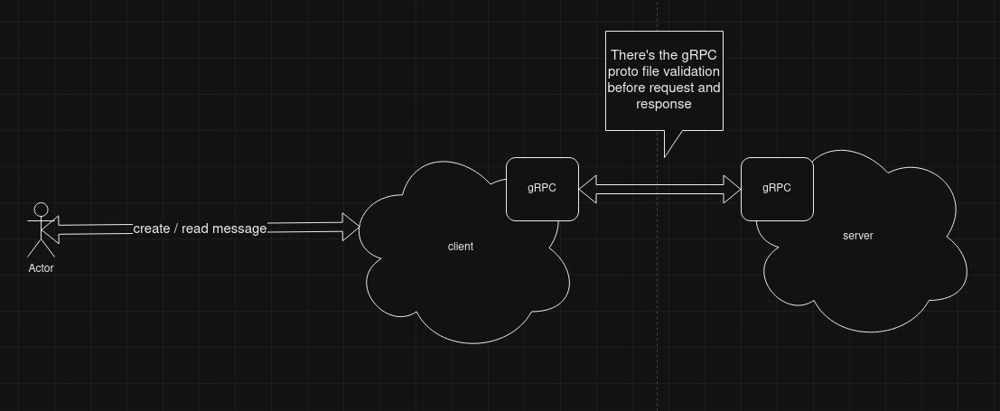

# gRPC communication

This repo, intent to build a simple sample of how serve and consume data using gRPC. 

## Project structure

I separed this project in two main folder as client and server. Inside wich one I configure a sample in golang of how to communicate using gRPC. The main ideia is to do the same using nodejs and further using java.

## Project intent

Learn and practive about gRPC architecture using a simple create and read message



## Running project

1 - Access desired client and server to run makefile commands

2 - Run with *make run*

## Building proto compiled files

1 - Access desired client and server to run makefile commands

2 - Run with *make generate-rpc*

## Contracts

### Generating messages

URL
```
POST /message/create
```

Header
* Content-Type: application/json

Body
```json
{
	"message":"string"
}
```

### Reading message

URL
```
GET /message/read
```

Header
* Content-Type: application/json